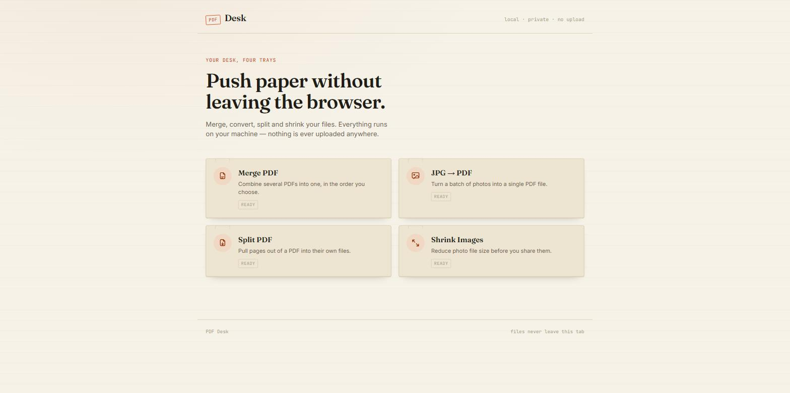

# PDF Desk

เว็บเครื่องมือจัดการไฟล์ PDF ใช้เอง — ทำงานฝั่ง browser ทั้งหมด (client-side) ไม่มีการอัปโหลดไฟล์ไปเซิร์ฟเวอร์ไหนเลย

**🔗 ใช้งานได้ที่:** https://anirut-dev.github.io/pdf-tools/



## ภาพรวมโปรเจค

- เป็นเว็บ **static HTML/CSS/JS** ล้วน ๆ ไม่มี build step (ไม่ต้อง npm install ก่อนใช้งาน)
- ใช้ไลบรารีต่าง ๆ โหลดผ่าน CDN (`unpkg.com`) ตามแต่ละเครื่องมือ (ดูตาราง "เทคสแตค")
- ไฟล์ PDF/รูปภาพ/เอกสารที่ผู้ใช้เลือก จะถูกประมวลผลในเบราว์เซอร์ของผู้ใช้เองทั้งหมด ไม่ส่งไปที่ไหน

## เทคสแตค

| ส่วน | เทคโนโลยีที่ใช้ |
|---|---|
| โครงสร้างหน้าเว็บ | HTML5 |
| สไตล์ | CSS3 (ไฟล์เดียว ใช้ร่วมกันทุกหน้า: `css/style.css`) |
| ฟอนต์ | Google Fonts — Fraunces (หัวข้อ), Inter (เนื้อหา), JetBrains Mono (ตัวเลข/label) |
| ตรรกะ/การทำงาน | JavaScript (Vanilla ไม่มี framework) |
| อ่าน/เขียน/รวม/แยกไฟล์ PDF | [pdf-lib](https://pdf-lib.js.org/) |
| รับรู้/render หน้า PDF เป็นรูป | [pdf.js](https://mozilla.github.io/pdf.js/) |
| render HTML/ตาราง Excel เป็นภาพก่อนทำ PDF | [html2canvas](https://html2canvas.hertzen.com/) + [jsPDF](https://github.com/parallax/jsPDF) |
| อ่านไฟล์ Excel (.xlsx/.xls) | [SheetJS (xlsx)](https://sheetjs.com/) |
| บีบอัดหลายไฟล์เป็น .zip | [JSZip](https://stuk.github.io/jszip/) |

## โครงสร้างไฟล์

```
pdf-tools/
├── index.html            # หน้าแรก แสดงการ์ด 8 เครื่องมือ
├── css/
│   └── style.css         # สไตล์ทั้งหมด ใช้ร่วมกันทุกหน้า
├── js/
│   ├── merge.js           # ตรรกะ Merge PDF
│   ├── jpg-to-pdf.js      # ตรรกะ JPG → PDF
│   ├── split.js           # ตรรกะ Split PDF
│   ├── shrink.js          # ตรรกะ Shrink Images
│   ├── pdf-to-jpg.js      # ตรรกะ PDF → JPG
│   ├── html-to-pdf.js     # ตรรกะ HTML → PDF
│   ├── pdf-to-pdfa.js     # ตรรกะ PDF → PDF/A-style
│   └── excel-to-pdf.js    # ตรรกะ Excel → PDF
├── tools/
│   ├── merge.html         # หน้า Merge PDF
│   ├── jpg-to-pdf.html    # หน้า JPG → PDF
│   ├── split.html         # หน้า Split PDF
│   ├── shrink.html        # หน้า Shrink Images
│   ├── pdf-to-jpg.html    # หน้า PDF → JPG
│   ├── html-to-pdf.html   # หน้า HTML → PDF
│   ├── pdf-to-pdfa.html   # หน้า PDF → PDF/A-style
│   └── excel-to-pdf.html  # หน้า Excel → PDF
├── assets/
│   └── screenshot.jpg     # ภาพหน้าจอสำหรับ README
└── docs/
    └── postmortems/       # บันทึกบั๊กที่เจอและแก้แล้ว
```

## สถานะเครื่องมือ (8 อย่าง)

| เครื่องมือ | สถานะ |
|---|---|
| รวมไฟล์ PDF (Merge PDF) | ✅ เสร็จแล้ว ทดสอบแล้ว |
| แปลง JPG → PDF | ✅ เสร็จแล้ว ทดสอบแล้ว |
| แยกหน้า PDF (Split PDF) | ✅ เสร็จแล้ว ทดสอบแล้ว |
| ลดขนาดรูปภาพ (Shrink Images) | ✅ เสร็จแล้ว ทดสอบแล้ว |
| แปลง PDF → JPG | ✅ เสร็จแล้ว ทดสอบแล้ว |
| แปลง HTML → PDF | ✅ เสร็จแล้ว ทดสอบแล้ว |
| แปลง PDF → PDF/A-style (best-effort, ไม่ใช่ PDF/A แบบรับรองมาตรฐาน) | ✅ เสร็จแล้ว ทดสอบแล้ว |
| แปลง Excel → PDF (ดั๊มพ์ข้อมูลตาราง ไม่ใช่ print layout จริง) | ✅ เสร็จแล้ว ทดสอบแล้ว |

## เครื่องมือที่คิดไว้แต่ยังไม่ทำ (ค้าง issue ไว้ตั้งใจ)

ประเมินแล้วว่ายากเกินไปสำหรับข้อจำกัดของโปรเจคนี้ (static site, ไม่มี backend, ไลบรารีต้องโหลดผ่าน CDN ได้) — เก็บ issue ไว้แบบเปิดค้างโดยตั้งใจ ไม่ใช่ลืมทำ เผื่ออนาคตมีไอเดียซ้ำจะได้ย้อนมาดูเหตุผลได้:

| Issue | เครื่องมือ | เหตุผลที่ค้างไว้ |
|---|---|---|
| [#6](https://github.com/anirut-dev/pdf-tools/issues/6) | WORD → PDF | ไม่มีไลบรารีเบา ๆ ที่ render โครงสร้าง .docx ได้ครบ ทำได้แค่ประมาณการผ่าน mammoth.js → HTML → PDF |
| [#7](https://github.com/anirut-dev/pdf-tools/issues/7) | POWERPOINT → PDF | เหมือน #6 แต่ต้องจัดการตำแหน่ง object ต่อสไลด์เพิ่ม ซับซ้อนกว่า |
| [#9](https://github.com/anirut-dev/pdf-tools/issues/9) | PDF → WORD | ทิศทางย้อนกลับ (แกะ PDF กลับเป็นเอกสารแก้ไขได้) แทบเป็นไปไม่ได้ด้วย client-side library — แม้แต่เครื่องมือมืออาชีพยังทำได้ไม่สมบูรณ์ |
| [#10](https://github.com/anirut-dev/pdf-tools/issues/10) | PDF → POWERPOINT | เหตุผลเดียวกับ #9 |
| [#11](https://github.com/anirut-dev/pdf-tools/issues/11) | PDF → EXCEL | เหตุผลเดียวกับ #9 |

## วิธีใช้งาน (dev)

เปิดไฟล์ `index.html` ผ่าน local server (เช่น VS Code Live Server หรือ `npx http-server`) แล้วเข้าเว็บผ่าน `http://localhost:...`

> หมายเหตุ: เปิดไฟล์ตรง ๆ ผ่าน `file://` อาจมีปัญหาเรื่อง CORS กับบางเบราว์เซอร์ แนะนำให้รันผ่าน local server เสมอ

## ดีไซน์

ธีม "โต๊ะทำงานกระดาษ" (paper desk) — พื้นหลังสีกระดาษอุ่น ๆ ตัวอักษรสีหมึกเข้ม และสีส้มแบบตราปั๊ม (stamp) เป็นสีเน้น
- มือถือ: การ์ดเรียงเป็นแถวเดียวแบบแอป
- PC: การ์ดจัดเป็น grid 2 คอลัมน์ (breakpoint ที่ 720px)
